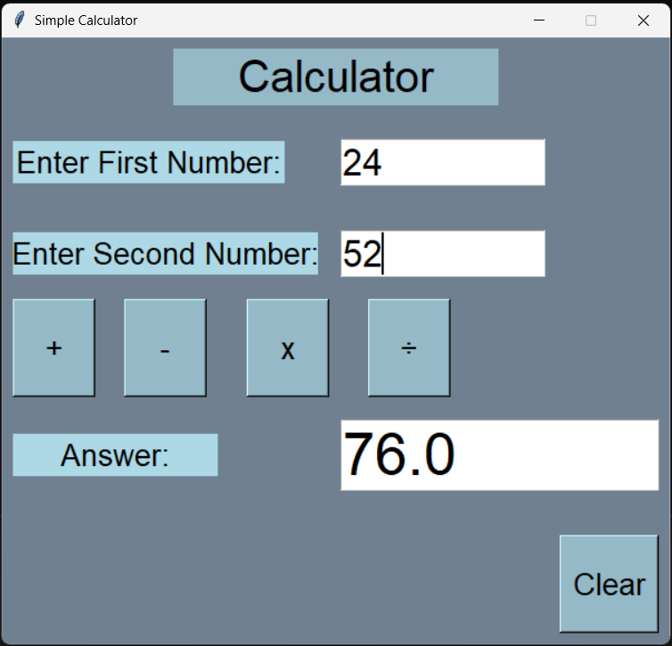

# 🧮 Python Tkinter Simple Calculator

A lightweight, user-friendly desktop calculator application built using Python's built-in `tkinter` library. This project demonstrates core GUI layout management and basic arithmetic event handling.

### 📸 Application Interface


### ✨ Features
* **Core Math Operations:** Performs addition, subtraction, multiplication, and division.
* **Floating Point Accuracy:** Handles decimal inputs and outputs rounded to one decimal place for clean reading.
* **Custom UI/UX:** Built using the Tkinter `grid` system for a structured layout, featuring a slate gray background (`#708090`) and light blue accents.
* **Quick Clear:** A dedicated clear button to easily reset the input and output fields for the next calculation.

### 🛠️ Built With
* **Python 3**
* **Tkinter**

### 🚀 How to Run
Since this application uses standard Python libraries, there is no need to install external packages.

1. Clone or download this repository to your local machine.
2. Open your terminal or command prompt.
3. Run the application:
   ```bash
   python Calculatorsimple.py
